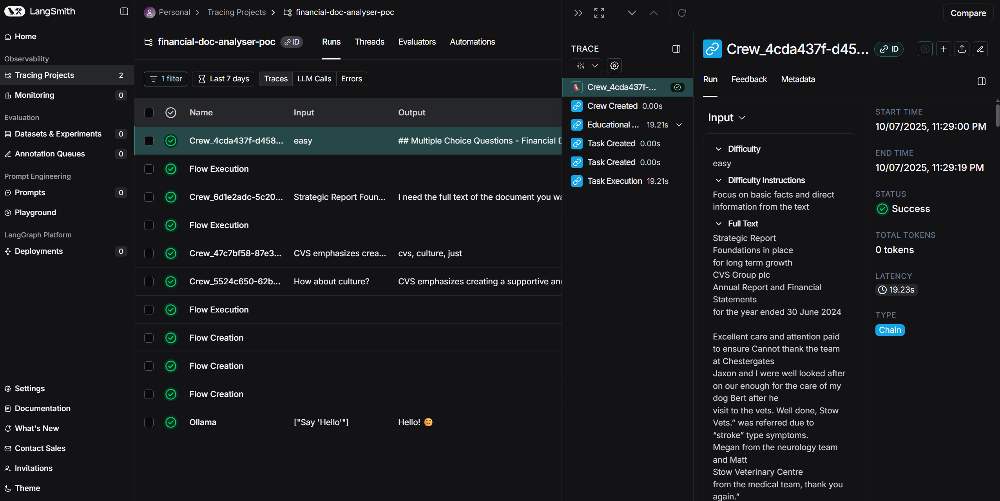

# Financial Document Analyzer (PoC)

A proof-of-concept application for analyzing financial documents using multi-agent AI systems. This application leverages CrewAI and LangChain to extract insights, answer questions, generate summaries, and create multiple-choice questions from financial documents.

## 🌟 Project Overview

The Financial Document Analyzer is designed to process financial documents (PDFs, CSVs) and provide various analytical capabilities through a user-friendly Streamlit interface. The system uses a multi-agent architecture powered by CrewAI to perform specialized tasks on the uploaded documents.

## 🚀 Key Features

- **Document Processing**: Upload and process PDF and CSV financial documents
- **Question & Answer**: Ask questions about the documents and get AI-powered answers
- **Document Summarization**: Generate concise summaries of financial documents
- **Multiple-Choice Questions**: Automatically generate MCQs based on document content
- **Keyword Extraction**: Identify key terms and concepts from documents
- **Vector Search**: Efficient document retrieval using FAISS vector store

## 🛠️ Technologies Used

- **CrewAI**: Multi-agent orchestration framework
- **LangChain**: Framework for LLM application development
- **Streamlit**: Web application framework for the user interface
- **FAISS**: Vector database for efficient similarity search
- **Sentence Transformers**: Document embedding generation
- **FastMCP**: MCP (Multi-Context Protocol) server implementation
- **Ollama**: Local LLM serving
- **OpenTelemetry**: Monitoring and tracing

## 🏗️ Architecture

The application follows a modular architecture with the following components:

### Core Components

1. **Streamlit Web Interface**: User-facing application for document upload and interaction
2. **CrewAI Agents**: Specialized AI agents for different tasks
   - QA Crew: Answers questions about documents
   - Summary Crew: Generates document summaries
   - MCQ Crew: Creates multiple-choice questions
   - Keyword Crew: Extracts important keywords
3. **Document Processing Pipeline**: Handles document loading, chunking, and embedding
4. **Vector Store**: FAISS-based vector database for document retrieval
5. **MCP Servers**: Specialized servers for enhanced agent capabilities

### Data Flow

1. User uploads documents through the Streamlit interface
2. Documents are processed, chunked, and stored in the vector database
3. User selects an operation (QA, Summary, MCQ)
4. The appropriate CrewAI flow is triggered
5. Results are displayed in the Streamlit interface

## 📂 Project Structure

```
├── app.py                  # Main Streamlit application
├── config/                 # Configuration settings
│   └── settings.py         # Application settings
├── crews/                  # CrewAI agent definitions
│   ├── keyword_crew/       # Keyword extraction crew
│   ├── mcq_crew/           # Multiple-choice question crew
│   ├── qa_crew/            # Question answering crew
│   └── summary_crew/       # Document summarization crew
├── data/                   # Data storage
│   ├── processed/          # Processed document data
│   ├── uploads/            # Uploaded documents
│   └── vector_store/       # FAISS vector indices
├── flows/                  # CrewAI flow definitions
│   ├── mcq_flow.py         # MCQ generation flow
│   ├── qa_flow.py          # Question answering flow
│   └── summary_flow.py     # Document summarization flow
├── logs/                   # Application logs
├── mcp_servers/            # MCP server implementations
├── proxy/                  # Proxy configurations
├── tools/                  # Custom tools for agents
└── utils/                  # Utility functions
    ├── document_loader.py  # Document loading utilities
    ├── flow_helpers.py     # Flow helper functions
    ├── llm_manager.py      # LLM connection management
    └── vector_store_manager.py # Vector store operations
```

## 🚀 Quick Start

### Prerequisites

- Python 3.11+
- Conda (recommended for environment management)
- Ollama (for local LLM serving)

### Environment Setup

1. Clone the repository:
   ```bash
   git clone https://github.com/yourusername/financial-doc-analyzer-poc.git
   cd financial-doc-analyzer-poc
   ```

2. Create and activate the conda environment:
   ```bash
   conda env create -f environment.yml
   conda activate genai-poc
   ```

3. Install Ollama and start the server:
   ```bash
   # Follow instructions at https://ollama.com/download
   ollama serve
   ```

4. Pull the required models:
   ```bash
   ollama pull gemma2:2b
   ```

### Running MCP Servers

1. Start the MCP server:
   ```bash
   python mcp_servers/mcp_words_server.py
   ```

2. Start the Proxy server: 
   ```bash
   python proxy/proxy.py
   ```
Note: Needed for manage authentication and authorization for MCP servers.

### Running the Application

1. Start the application:
   ```bash
   streamlit run app.py
   ```   

2. Open your browser and navigate to:
   ```
   http://localhost:8501
   ```

3. Upload financial documents and start analyzing!

## 📊 Usage Examples

### Document Q&A
1. Upload a financial document (PDF or CSV)
2. Navigate to the Q&A tab
3. Enter your question about the document
4. View the AI-generated answer with source references

### Document Summarization
1. Upload a financial document
2. Navigate to the Summary tab
3. Click "Generate Summary"
4. View the AI-generated summary of the document

### MCQ Generation
1. Upload a financial document
2. Navigate to the MCQ tab
3. Click "Generate Questions"
4. Answer the generated questions to test your knowledge

### Showcase: 
- [Watch the Video](https://www.youtube.com/watch?v=q3HwBHj-J78)

## 🔧 Configuration

The application can be configured through the `config/settings.py` file, which includes settings for:

- Document processing parameters
- Vector store configuration
- LLM model selection
- Agent behavior parameters

## Monitoring

- Open your Langsmith: [Langsmith](https://www.langchain.com/langsmith)
- Sign up or log in
- Navigate to the "Projects" section
- Create a new project or select an existing one
- Set up your project with the required settings



## 📞 Contact

raul06.orellana@gmail.com